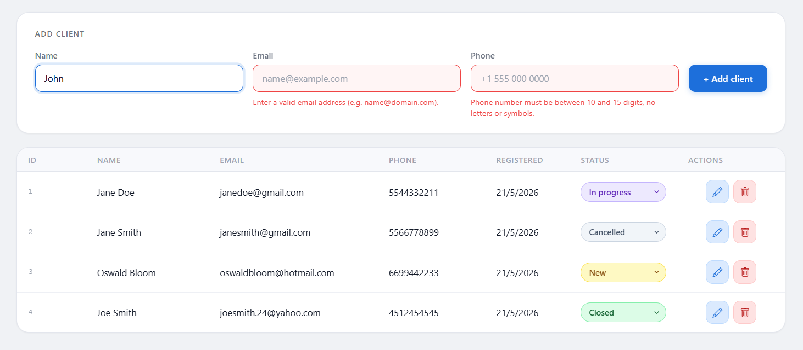
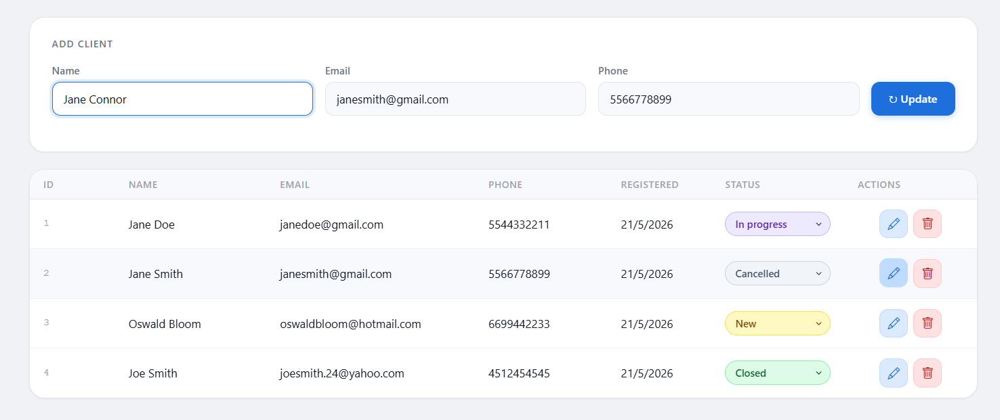

# CRM Project

A customer management CRM built with JavaScript that allows users to create, edit and delete clients with local storage persistence.

## Features

- Create clients
- Edit client information
- Delete clients
- Form validations
- Local storage persistence

## Technologies

- HTML
- CSS
- Vanilla JavaScript

## What I Learned

- DOM manipulation
- Form validation
- Event handling
- Local storage persistence

## Installation

1. Clone the repository
2. Open index.html

## Future Improvements

- Database integration
- User authentication
- Responsive design improvements
- Improved visual design and UI
- Custom states with editable colors
- Notes section for each client
- Filters by name, A-Z, latest, earliest, and ID number
- Delete confirmation popup before removing a client

## Preview

### Client List

### Editing a Client

